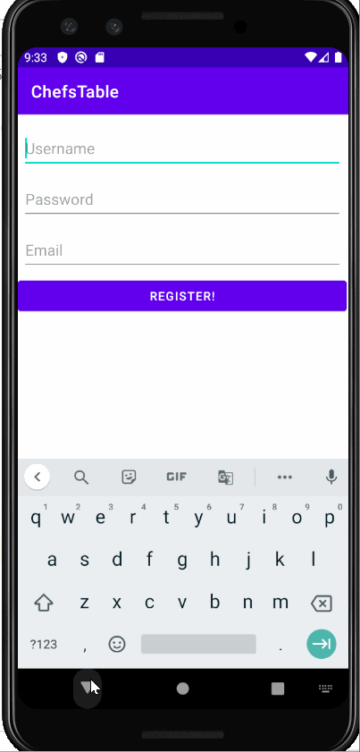

Original App Design Project - README Template
===

# Chef's Table

## Milestone 3


### Milestone 2


### Milestone 1
<br>

-------

## Table of Contents
1. [Overview](#Overview)
1. [Product Spec](#Product-Spec)
1. [Wireframes](#Wireframes)
2. [Schema](#Schema)

## Overview
### Description
The Chef's Table App will allow users share pictures of the current recipes that they are working on. This will display their progress bar on how far along they are, look at recipes, and post their recipe progress!

### App Evaluation
[Evaluation of your app across the following attributes]
- **Category:** Food
- **Mobile:** This application will use time stamp posts as people cook their recipes, such as using the camera and location.
- **Story:** Users will be able to search for recipes, add recipes, and even post their progress along the way.
- **Market:** For people who want to promote their own recipes or blogs. For people who want to share their favorite recipes with friends, family or anyone else.
- **Habit:** It helps all ages of people to spend time on this site to develop their cooking skill,or cooking as a habit, it might develop passion on cooking and create wonderful chefs  with the information wide range of recpies all over the world. This can be used whenever someone wants to share their tasty food.
- **Scope:** This application will start out more narrow in terms of just posting pictures of recipes with the recipes attached at the description. This will allow unique users to share other recipes with one another.

## Product Spec

### 1. User Stories (Required and Optional)

**: Optional

**Required Must-have Stories**
* User is able to log-in [x]
* User can register for a new account [x]
* User can look up a variety of recipes [x]
* Users are able to compose/create posts. [x]
* Users are able to use the camera. [x]
* Users are able to see the progress above the post**

**Optional Nice-to-have Stories**

* Other users could like and comment on the posts.
* Users will be able to check other user progress for recipe
* Users can see an indeterminate progress bar indicating how far along they are while making this recipe.

### 2. Screen Archetypes

* Log-in Screen
   * User will log-in
* Register Screen
   * User will register
* Compose Screen
    * User will be able to compose a recipe based off the recipe selected!
* Stream
    * User will be able to see a feed of recipes and photos.
* Recipe Selection Screen
    * User will be able to search a broad library of recipes.
* Profile Screen
    * User will be able to current progress on personal recipes.

### 3. Navigation

**Tab Navigation** (Tab to Screen)

* Search Recipe
* Profile
* Add recipe
* Stream

**Flow Navigation** (Screen to Screen)

* Forced Log-in -> Account creation if no log in is available
* Recipe Steam -> Posts
* Profile -> How many induvidual recipes completed
* Recipe Search/Selection -> Detailed recipe screen
* Detailed Recipe Screen -> If the user selects the recipe, this will take them to a compose screen.
 
## Wireframes


### [BONUS] Digital Wireframes & Mockups


## Schema 
### Models

**Post**
| Property |    Type  | Description |
| -------- | -------- | -------- |
| ObjectID | String   | Unique id for the user post (default field)    |
| image | File | Photos used in the recipes shown in app
| user  | Pointer to User| Username that will show who created the post      |
| Caption | String | Image caption by author |
| createdAt | DateTime | Date when post was created     |
| updatedAt |DateTime|Date when post is last updated|


**User**
| Property |    Type  | Description |
| -------- | -------- | -------- |
| image| File | User profile image
| user | Pointer to User| Username
| bio | String | biography of user |
| email |String | email for user |
| recipeCt | int | number of recipes completed by user |

**Home Profile Feed**
| Property |    Type  | Description |
| -------- | -------- | -------- |
| image     | File    | Recipe image|
| caption  |   String |	image caption by author|
| ObjectID | Pointer to User | Username 
| image | File | User profile of the post


**Search Recipe**
| Property |    Type  | Description |
| -------- | -------- | -------- |
| strMeal  | String | name of specific meal |
| idMeal  | ID | name of specific meal |
| strTags | String | keyword(s) used to find recipe from user search request |
| searchInput | Pointer To Search | user input created to find specific recipes |

**Detailed Recipe**
| Property |    Type  | Description |
| -------- | -------- | -------- |
|  strMeal | String | name of the specific meal |
| strInstructions | String | instructions of the specific meal
| strIngredient | String | ingredients for that specific meal
| strMeasure | String | measurements for specific ingredients needed for the meal |
| strYoutube | String | link to YouTube video of recipe |
| strMealThumb | String | link to display picture of the meal


### Networking
- User sign-up/Register
    * (Create/USER) User will register for platform
    * (Read/GET) Read user data for login to app
```Java    
String username = "chef"
String password = "password123";
String email = "coolchef@gmail.com";
ParseUser user = new ParseUser();

user.setEmail(email);
user.setUsername(username);
user.setPassword(password);
user.signUpInBackground(new SignUpCallback() {
                    @Override
                    public void done(ParseException e) {
                        if (e != null) {
                            Log.e(TAG, "Issue with registering user", e);
                            Toast.makeText(SignUpActivity.this, "Issue with the Login", Toast.LENGTH_SHORT).show();
                            return;
                        }

                        goMainActivity();
                        Toast.makeText(SignUpActivity.this, "Success!",Toast.LENGTH_SHORT).show();
```
- Home Feed Screen
    * (Read/GET) Query all posts 
    * (Create/POST) Create a new like on a post
    * (Create/POST) Create a new comment on a post
    * (Delete) Delete existing comment
```java    
List<Posts> posts;
String comments [];
Context context;
int likes;
public postsAdapter(Context context, List <Posts> p)
{
this.context = context;
this.posts = p;
}

public void addAll(List<Post> list) {
        posts.addAll(list);
        notifyDataSetChanged();
    }
    
    /*
     * Display user likes with the post.
     * 
     * Display the list of comments below the post
     * 
     * 
```
- Create Post Screen
    * (Create/POST) Create a new post object
```java
ParseQuery<ParseObject> query = ParseQuery.getQuery("RecepieCount");
query.whereEqualTo("userName", "Sean Plott");
query.countInBackground(new CountCallback() {
  public void done(int count, ParseException e) {
    if (e == null) {
      // The count request succeeded. Log the count
      Log.d("score", "Sean has created " + count + " recepies");
    } else {
      // The request failed
    }
  }
});
```
- Profile Screen
    * (Read/GET) Query logged in user object
```java
ParseUser.logInInBackground("Jerry", "showmethemoney", new LogInCallback() {
  public void done(ParseUser user, ParseException e) {
    if (user != null) {
      // Hooray! The user is logged in.
    } else {
      // Signup failed. Look at the ParseException to see what happened.
    }
  }
});

```
- Profile Image
    * (Update/PUT) Update user profile image
```java    
 ParseQuery<ParseObject> query = ParseQuery.getQuery(user.class);
    
    // Include the post data with each comment
    query.include("Author"); // the key which the associated object was stored
    
    // Execute query with eager-loaded owner
    query.findInBackground(new FindCallback<ParseObject>() {
     ....
    }       

```

## Endpoints

- ### Back4App (to be created)
    - Base URL - [https://parseapi.back4app.com/classes/ChefsTable](https://parseapi.back4app.com/classes/ChefsTable)

   | HTTP Verb | Endpoint | Description |
   | ----------|----------| ----------- |
   | `POST`    | /classes/Post/User | we get data from the user of their progress step(s) for their post |
   | `GET`     | /classes/Post/Recipe | we get data from TheMealDB API for the recipe |
   | `GET`     | /users | we get user details when we are logging in, and the Profile fragment |
   | `POST`    | /users | we post when the user is signing up for a new profile or creating a post  |

- ### TheMealDB API
    - Base URL - [https://www.themealdb.com/api.php](https://www.themealdb.com/api.php)

   HTTP Verb | Endpoint | Description
   ----------|----------|------------
    `GET`    | /strMeal | get recipe name
    `GET`    | /strInstructions| return recipe instructions
    `GET`    | /strMealThumb   | get image of recipe
    `GET`    | /strIngredientN | return nth ingredient
    `GET`    | /strMeasurementN | return nth measurement of nth ingredient
    `GET`    | /strYoutube | get link to YouTube video
